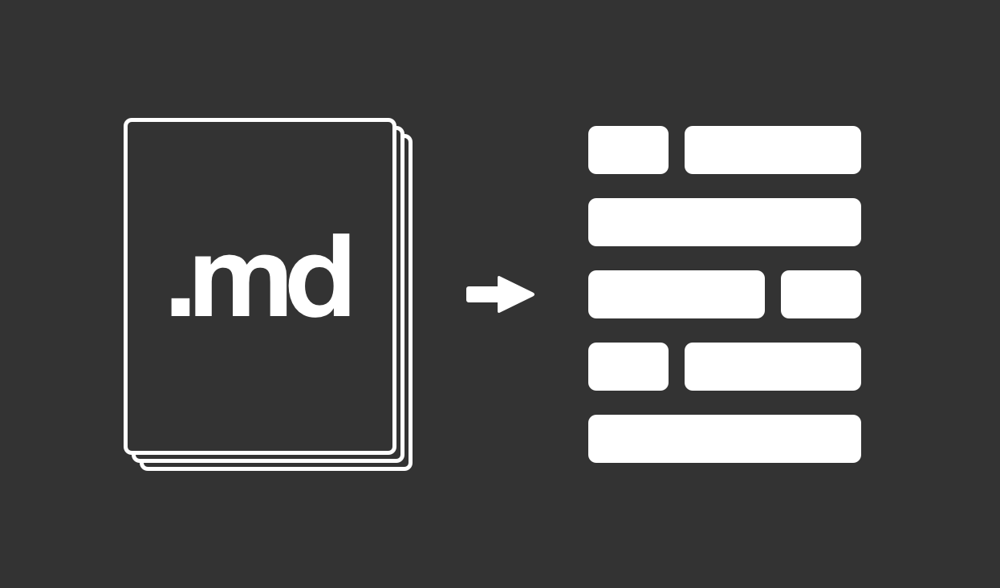
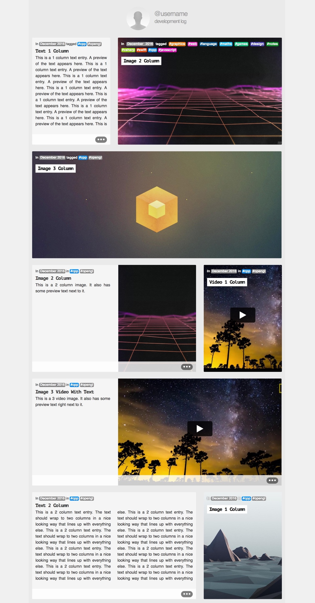

# Devlog

Create a static HTML website containing development logs that are
generated from individual markdown files.

Take a list of .md files, each containing a separate entry and output a static HTML site:

TODO:

- [x] Text entries
- [x] Image entries
- [x] Video entries (Youtube video support)
- [ ] GIF entries
- [ ] Automatic resizing of log entries to fill rows
- [ ] JS disabled version
- [ ] Proper README

Takes markdown files as input and outputs:
